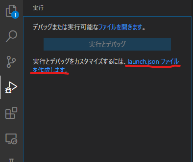
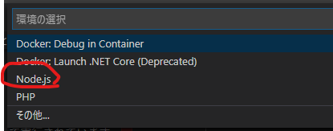
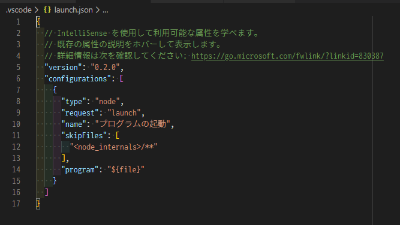

# Javascript基本構文

## リファレンスサイトなど

- [MDN Javascript](https://developer.mozilla.org/ja/docs/Web/JavaScript)
- [JavaScript Primer](https://jsprimer.net/)
- [現代の JavaScript チュートリアル](https://ja.javascript.info/)
- [Can I use](https://caniuse.com/#home)
- [ECMAScript](https://kangax.github.io/compat-table/es6/)
- [Polyfill.io](https://polyfill.io/v3/url-builder/)
- [【脱jQuery！】ネイティブなJavaScript（Vanilla JS）への書き換え方まとめ](https://wemo.tech/2101)
- [JQueryをVanilla JSに緩やかに置き換える](https://qiita.com/nightyknite/items/668c112c40931515ed67)

## ざっくり概要

JavaScriptはECMAScriptをベースに作成されています。  
実行時にコンパイルされてプログラムが実行されます。

サーバなどブラウザ以外の環境でも実行することができます。  
Sassのトランスパイルに使用したGulpはNode.jsというコンパイラによって実行されています。  
ブラウザではChromeのV8やFirefoxのSpiderMonkeyなどブラウザごとに異なるため、実装に違いがでたりします。動作の確認は複数のブラウザで行いましょう。  

現在ほとんどのブラウザでは最新のECMAScriptにすぐに対応していっていますが、IE11ではほとんどES5までの対応となるの書き方には注意が必要です。(少なくとも2025年10月14日まではIE11が存在します)  
トランスパイルができない案件(Wordpress案件などのサーバがHTMLを出力するような案件)では注意しましょう。  
IE11など機能をサポートしていないブラウザのためのポリフィルもありますのでそういったものを活用するのも良いでしょう。

ちなみにVSCodeは[ELECTRON](https://www.electronjs.org/)というデスクトップアプリを作成するソフトウェアフレームワークで、画面のレンダリングはChromium(Chrome)を使用し、ファイル操作などはNode.jsを使用してアプリケーションを作成します。
頑張ればHTMLやCSS、Javascriptでこんなアプリケーションを作成することができるということですね😁

## VSCodeでデバッグできるように設定を行う

虫のマークの付いたボタンを押し、開いたパネルの「launch.jsonファイルを作成します。」をクリックします。

「Node.js」をクリックします。

下のようなファイルが作成されればOKです。

